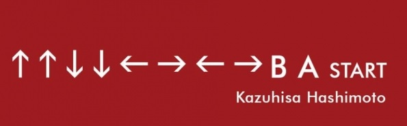

Me chamo Matheus, tenho 24 e sou apaixonado pela área de desenvolvimento, principalmente a parte de frontend.

💻 Atualmente trabalho como Analista de Sustentação e estou investindo para que possa alcançar minha carreira como dev. Estou investindo em cursos e bootcamps (como o GoStack da Rocketseat) e também em projetos pessoais para incrementar meu portfólio e demonstrar minha experiência através deste.

🌎 Sou fluente em inglês e não tenho dificuldades na comunicação/leitura/escrita. Muito do que aprendi sobre Javascript e Python foram com materiais em inglês.

🎼 Meu maior hobby é a música! Atualmente toco violão, guitarra, piano, gaita e arranho um pouquinho no violino. Também gosto de jogar alguns jogos nos finais de semana e me divertir para descansar um pouco a mente.

<!--
**MatheusDev-1/MatheusDev-1** is a ✨ _special_ ✨ repository because its `README.md` (this file) appears on your GitHub profile.

Here are some ideas to get you started:

- 🔭 I’m currently working on ...
- 🌱 I’m currently learning ...
- 👯 I’m looking to collaborate on ...
- 🤔 I’m looking for help with ...
- 💬 Ask me about ...
- 📫 How to reach me: ...
- 😄 Pronouns: ...
- ⚡ Fun fact: ...
-->
